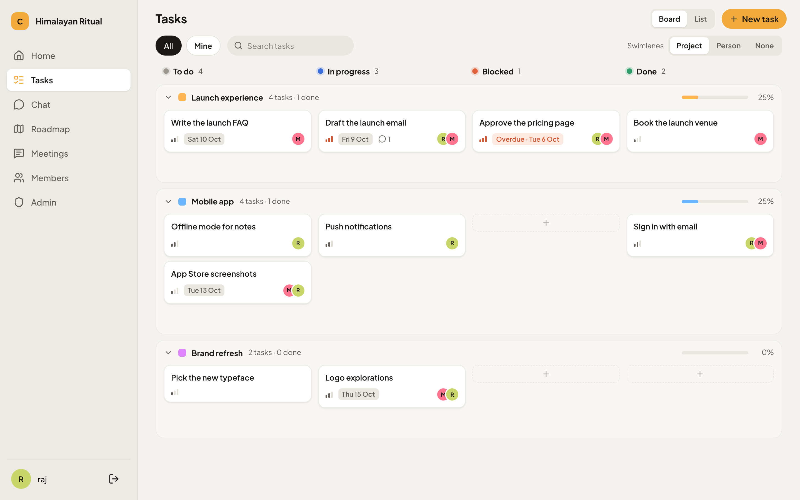
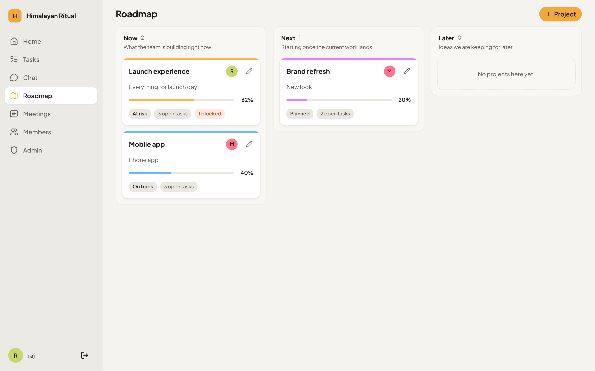
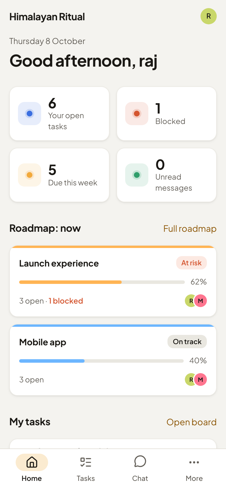

# Collaboration Tool

[](https://github.com/rajgurung/collaboration_tool/actions/workflows/ci.yaml)
[](https://collab.rajgurung.me)
[](https://github.com/rajgurung/collaboration_tool/commits/main)
[](LICENSE)
[](.github/workflows/claude-code-review.yml)


A calm workspace for small teams. Plan the roadmap, track tasks, keep meeting notes and chat, all in one place.

**[Try it at collab.rajgurung.me →](https://collab.rajgurung.me)**



## What you can do

- 🗺️ **Roadmap.** See what the team is building now, next and later, with progress and owners.
- ✅ **Tasks.** A board with swimlanes by project or person. Drag cards between columns, share a task with several people, and add notes.
- 📝 **Meetings.** Keep the summary and the decisions in one place.
- 💬 **Chat.** Channels, groups and direct messages, live.
- 🔔 **Notifications.** @mention someone in chat or a task note, and they see it in their bell straight away. Assignments and project activity show up there too.
- 🤖 **Works with Claude.** Connect Claude and ask it to plan, create and update tasks for you.
- 🌗 **Light and dark.** Follows your system setting, on desktop and phone.
- 🔒 **Private by default.** Each organisation sees only its own work. New people join through a link, and an owner approves them.

<p>
  
  &nbsp;
  
</p>

## Use with Claude

Claude can read and change your projects, tasks and task notes, as you. It can't see chat, meetings or emails.

- **claude.ai and the Claude apps:** Settings → Connectors → Add custom connector, paste `https://collab.rajgurung.me/mcp`, press Connect, then Allow.
- **Claude Code:** `claude mcp add --transport http collab https://collab.rajgurung.me/mcp`, then sign in when asked.

In Collab Tool, More → Connect Claude has the details, personal tokens, and a Revoke button for every connection. How it works: [docs/notes/claude-connector.md](docs/notes/claude-connector.md).

## How it's built

A Rust web app on [Loco](https://loco.rs), which works much like Rails. Pages are rendered on the server with Tera templates. HTMX and a little TypeScript make them feel quick. Chat runs over WebSockets.

Data lives in PostgreSQL. Email goes out through Resend. The app is deployed on Railway from the `Dockerfile`.

## How changes ship

1. Open a pull request.
2. CI runs formatting, Clippy and the tests.
3. Michael Scott, our review bot, reads the change and approves it or asks for fixes.
4. Merging to `main` deploys to Railway and runs any new migrations.

## Run it yourself

<details>
<summary>Local setup (Rust and Docker)</summary>

```sh
# Postgres 17 for development and tests, on port 5433
docker run -d --name collab-postgres -p 5433:5432 \
  -e POSTGRES_USER=loco -e POSTGRES_PASSWORD=loco -e POSTGRES_DB=collab_development postgres:17
docker exec collab-postgres psql -U loco -d collab_development -c "create database collab_test"

# Optional: catch outgoing email at http://localhost:8025
docker run -d --name collab-mailpit -p 1025:1025 -p 8025:8025 axllent/mailpit

# Start the app, with Tailwind and esbuild watching
bin/dev
```

Then open http://localhost:5150. Use `localhost`, not `127.0.0.1`, because form posts from other origins are rejected.

To look around every organisation, make yourself a platform super admin:

```sh
SUPER_ADMIN_PASSWORD=choose-one cargo loco task super_admin
```

The same checks CI runs:

```sh
cargo fmt --all
cargo clippy --all-targets -- -D warnings
cargo test
```

</details>

<details>
<summary>Where things live</summary>

| Path | What's there |
|---|---|
| `src/controllers` | One file per area: auth, signup, join, dashboard, roadmap, tasks, meetings, chat, members, admin |
| `src/models` | Domain logic. Generated SeaORM entities are in `_entities` |
| `src/extractors` | `CurrentUser` and `CurrentMember`, the access checks every page goes through |
| `src/workers` | Background jobs, such as sending email |
| `src/data` | Settings and the live chat hub |
| `assets/views` | Tera templates and components |
| `frontend` | Tailwind styles and TypeScript helpers |
| `migration` | Database migrations |
| `tests` | Request, model and view tests, including `tests/requests/tenancy.rs` |
| `docs` | Deployment guide, design notes and screenshots |

`SPEC.md` and `TASKS.md` record the plan this was built from. Deployment is covered in [`docs/deploy.md`](docs/deploy.md).

</details>

## License

MIT. See [LICENSE](LICENSE).
